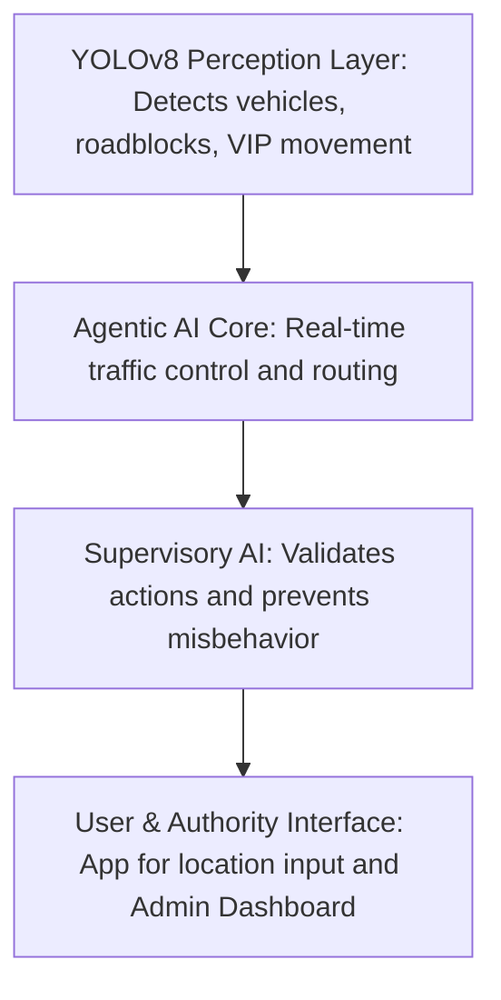
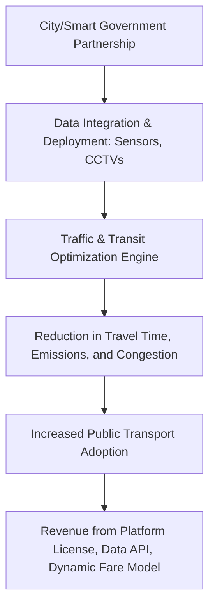

# 🚦 MargVedhaMain: Smart Urban Traffic Management System

A multi-layered, AI-powered solution aimed at optimizing public transportation through real-time traffic perception, dynamic routing, and agentic decision-making.

---

## 🔍 Overview

Urban public transport often suffers from:
- Long wait times
- Overcrowding
- Inefficiency
- Poor commuter experiences

MargVedhaMain introduces a **4-Layer AI Stack** to create a Smart, Real-Time Adaptive Transit Ecosystem.

---

## 🧠 System Architecture

**Layers:**
- **YOLOv8 Perception**: Computer vision for traffic object and anomaly detection.
- **Agentic AI Core**: Autonomous traffic decision-making (signals, buses, taxis).
- **Supervisory AI**: Monitors and validates Agentic AI actions.
- **Interface Layer**: Web app for authorities, Android app for commuters.

---

## 💼 Business Model

**Revenue Streams:**
- City-level Platform Licensing (SaaS)
- Real-time Traffic Data APIs for urban planners
- Commissions from AI-powered Dynamic Fare System

---

## 🔑 Key Features

- 🚌 Demand-based Bus & Taxi Routing (via App Check-ins)
- 🚦 Real-Time Signal Control (Reinforcement + Fuzzy Logic)
- 🧾 AI-Based Fare Estimation (Auto-Rickshaw, Taxi)
- 🛑 Accident Detection & Emergency Lane Clearance
- 👮 E-Challan Generation (Number Plate OCR)
- 📡 Admin Dashboard, Live Heatmaps, Congestion Zones

---

## 🌐 Live Preview

🔐 **Authentication Required (Testing Phase)**  
- **URL:** [https://marg-vedha.vercel.app/dashboard](https://marg-vedha.vercel.app/dashboard)
- **Email:** margvedha01@gmail.com  
- **Password:** DR@123

> The frontend prototype is live for demonstration. Backend and full AI integration are under development.

---

## 🛠️ Tech Stack

- **Frontend:** React, Vercel
- **Backend:** Node.js, Python (planned for AI integration)
- **AI/ML:** YOLOv8, Reinforcement Learning, Fuzzy Logic
- **Deployment:** Vercel, Cloud APIs
- **Mobile:** Android (user app, in progress)

---

## 📩 Contact

Interested in collaboration or want to know more?
- 📧 Email: margvedha01@gmail.com

---

## 📜 License

MIT License — Open for research, collaboration, and smart city innovation.

---

## 🤝 Contributing

We welcome contributions! Please open issues or pull requests for any suggestions or improvements. For major changes, please discuss via email first.

---

## ⭐ Acknowledgements

- OpenCV & YOLOv8 for computer vision
- React, Node.js, Python communities
- Smart city and urban mobility researchers
