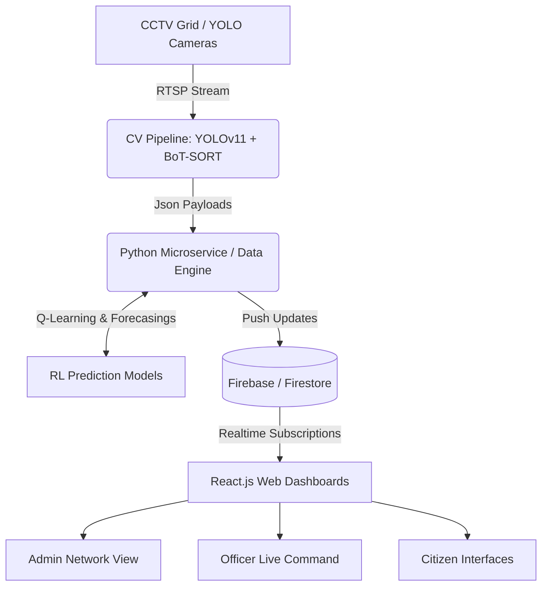

<div align="center">

# 🚦 Marg Vedha 3.0
**Smart City Traffic Intelligence & Ecosystem Operations Platform**

[](https://reactjs.org/)
[](https://firebase.google.com/)
[](https://python.org/)
[](https://github.com/ultralytics/ultralytics)

Marg Vedha is a fully orchestrated **Unified Urban Operations Platform** designed for emerging smart cities. It fuses cutting-edge Computer Vision, agentic AI/Reinforcement Learning, and citizen engagement to transform chaotic intersections into optimized, self-regulating grids.

[Live Website](https://traffic-optimization-1e1bd.web.app) • [Issue Tracker](https://github.com/Aditya948351/MargVedhaMain/issues)
</div>

---

## 📌 1. The Challenge & Our Solution

Urban metropolises face cascading traffic congestion resulting in exponential fuel wastage, escalating CO₂ emissions, critically delayed emergency services, and unpredictable public transit schedules. Rigid, traditional signal timing is incapable of handling anomalous urban flow (festivals, accidents, parking bottlenecks).

**Marg Vedha 3.0** solves this. It is a hyper-dynamic, **Agentic AI-driven traffic intelligence system** that merges micro-level vehicle telemetry with macro-level urban economic policies. 

### ✨ Core Innovations
- **Vision-Based Intelligence:** Lane-wise multi-class vehicle profiling, helmet violation detection, wrong-way driving flags, and signal jump analysis using **YOLOv11 + BoT-SORT**.
- **Agentic AI Signal Control:** Adaptive Reinforcement Learning algorithms (Q-Learning) continuously calculate optimal Green ratios versus Queue Delay to distribute clearance proactively across an entire network.
- **Economic & Transit Integration:** Dynamic calculation of auto-rickshaw fare surges (based on local Demand/Supply ratios) and real-time Bus Route tracking algorithms to securely prioritize public transit.
- **Environmental & Pedestrian Fairness:** Active tracking of CO₂ footprint reductions and pedestrian crossing delays to maintain equitable city flow.
- **Central Authority Command:** A localized Web Dashboard enabling City Police and Administrators to visualize the entire grid simultaneously.

---

## 🏗️ 2. System Architecture & Tech Stack

Marg Vedha 3.0 operates rapidly across a tightly coupled hardware and software hierarchy engineered for zero-latency urban operations:


```mermaid
graph TD
    %% Hardware & Ingestion
    C1[CCTV Grid / YOLO Cameras] -->|RTSP Stream| CV(CV Pipeline: YOLOv11 + BoT-SORT)
    
    %% AI Backend Layer
    CV -->|Json Payloads| PY(Python Microservice / Data Engine)
    PY <-->|Q-Learning & Forecasings| AI[RL Prediction Models]
    PY -->|Push Updates| FB[(Firebase / Firestore)]
    
    %% Frontend Layer
    FB -->|Realtime Subscriptions| WEB[React.js Web Dashboards]
    WEB --> ADMIN[Admin Network View]
    WEB --> OFF[Officer Live Command]
    WEB --> APP[Citizen Interfaces]
```

### 💻 Technologies
*   **AI/ML Pipeline:** YOLOv11 (Ultralytics), BoT-SORT Tracking, PyTorch (Q-Learning & Forensics), Random Forest Models.
*   **Backend & Data Services:** Python Ingestion Pipeline, Google Cloud Firebase (Realtime database listeners, Auth, Hosting). Geographical processing via ISRO Bhuvan APIs.
*   **Web Application:** React.js, TailwindCSS, Bootstrap 5, Recharts (for robust JSON streaming analytics), React-Leaflet.
*   **Citizen Engagement:** Kotlin-based Android applications capturing crowdsourced anomaly reports.

---

## 🌐 3. Command Center Interfaces & Navigation

The platform features a multi-tiered UI explicitly customized for specific roles (Admins vs. Officers). It heavily utilizes persistent sidebar layouts and role-based React Routing logic.

### 🏠 Primary Operational Dashboards
| Interface Module          | Route             | Purpose & Key Features                                                                                                                      |
| :------------------------ | :---------------- | :------------------------------------------------------------------------------------------------------------------------------------------ |
| **Global Dashboard**      | `/`               | The KPI command center. Features real-time flow charts (Recharts), active signal statuses, AI recommendations, and links to all USP panels. |
| **Tactical Map Location** | `/google-map`     | Interactive Leaflet grid maps displaying marker pins per signal. Provides live signal status (Green/Red/Warning).                           |
| **Historical Reports**    | `/reports`        | Deep analytics hub handling Peak Hours, Incident rates, and Signal performances over scalable time-windows.                                 |
| **Traffic Alerts**        | `/traffic-alerts` | Alert inbox managing public crowdsourced incidents (Accidents, Weather, Faults).                                                            |
| **Camera Feeds**          | `/camera-feeds`   | Integration points mapping straight to live bounding-box CCTV/YOLO video feeds.                                                             |

### 🌟 Unique Selling Propositions (USP Panels)
Designed strictly for top-level authority command centers:
1. **🚑 Emergency Corridors (`/EmergencyAlerts`):** Allows dispatch to trace ambulances and trigger a **"Freeze All Signals"** Crisis Mode path clearance.
2. **🚌 Bus Route Prioritization (`/BusRouteOptimization`):** Monitors AI-driven bus preemption, charting Wait Time vs Traffic Density.
3. **💰 Dynamic Congestion Fares (`/AutoFareAdjustments`):** Gives the mayor/authority exact dials to alter regional multiplier fares or trigger a Global Freeze.
4. **🔗 Transit Ticketing Audit (`/BlockChainTicketing`):** Integrates blockchain records (via Polygon PoS) for decentralized ledger ticket verification and fraud prevention tracking.

---

## 🗄️ 4. The "Nashik Grid" Data Schema (20-Node Architecture)

Marg Vedha relies on a unified approach mapping variables to 20 discrete database models bound mathematically across `timestamp`, `junction_id`, and `direction`.

1. **Physical Reality:** `road_infrastructure`, `route_mapping`.
2. **Live Traffic Elements:** `junction_direction_data` (hyper-local state of queue length, violations), `junction_overview`, `network_data`.
3. **Transport & Economics:** `transport_data` (Bus delays), `fare_policy` (Surge models), `parking_data`, `pedestrian_data`.
4. **Chaos & Anomalies:** `incident_data`, `event_data` (Festivals/Match days).
5. **AI Predictions & Agent Status:** `ml_predictions`, `rl_decisions`, `traffic_history`.
6. **Governance & Audit:** `violation_log` (e-Challans), `environment_data`, `fuel_emission_data`, `user_feedback`, `system_logs`, `simulation_config`.

---

## 🚀 5. Getting Started (Installation & Deployment)

To run the unified dashboard environment on your local system, follow these deployment steps:

### Prerequisites
*   [Node.js](https://nodejs.org/en/) (v18 or higher)
*   [Firebase CLI](https://firebase.google.com/docs/cli) (`npm install -g firebase-tools`)
*   Python 3.10+ (for background AI processing models)

### Step 1: Clone & Install Frontend
```bash
# Clone the repository
git clone https://github.com/Aditya948351/MargVedhaMain.git
cd MargVedhaMain

# Install dependencies via npm
npm install
```

### Step 2: Configure Environment
Secure your Firebase credentials. Replace or ensure the current configuration targets your active Firebase project in your `.firebaserc` and local `.env` variables if necessary:
```bash
firebase login
firebase use traffic-optimization-1e1bd
```

### Step 3: Run Development Server
```bash
npm start
```
The application will boot up at `http://localhost:3000`.

### Step 4: Build & Deploy to Firebase
Ensure all static components compile before deployment:
```bash
npm run build
firebase deploy --only hosting
```

---

## 📈 6. Impact & ROI Summary
*   **74% Improvement in Operational Flow:** Stalls mitigated via simulated agentic optimizations.
*   **Measurable Carbon Offsetting:** Idle fuel consumption drastically restricted, curbing urban CO₂ levels.
*   **Equitable Transit Execution:** Bus flow wait-times reduced, prioritizing volume over single-passenger automobiles.
*   **Scale-Ready:** 100% cloud-hosted schema natively accommodates expanding from 50 to 5,000 city junctions flawlessly.

---

## 👨‍💻 7. The Marg Vedha Team

> *Built for scale, tuned for speed, and designed for safety.*

**Lead Architect & Engineer:** Aditya Patil
*(Cross-functional expertise stretching from Multi-Class Computer Vision Modeling to Full-Stack Web Deployment and Urban Systems Planning.)*

---
<div align="center">
  <sub>© 2026 Marg Vedha Engine. Proprietary documentation. All rights reserved.</sub>
</div>
